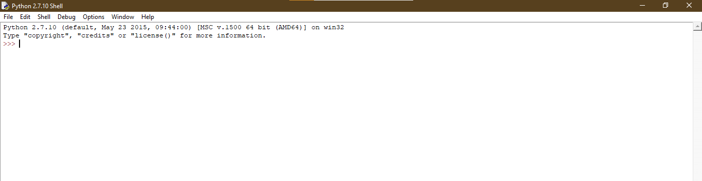

### Installation


1. Clone the repo
   ```sh
   git clone https://github.com/your_username_/Project-Name.git
   ```
   If you don't know how to clone, here is a quick tutorial <a href="https://www.jcchouinard.com/clone-github-repository-on-windows/"> git clone tutorial</a>
2. Install python packages
   ```sh
   pip install pikepdf
   ```
   If you don't know about how to install python libraries, <a href="https://packaging.python.org/en/latest/tutorials/installing-packages/">Tutorial</a>
3. Open python idle
    
4. Open the file
5. Run the file


